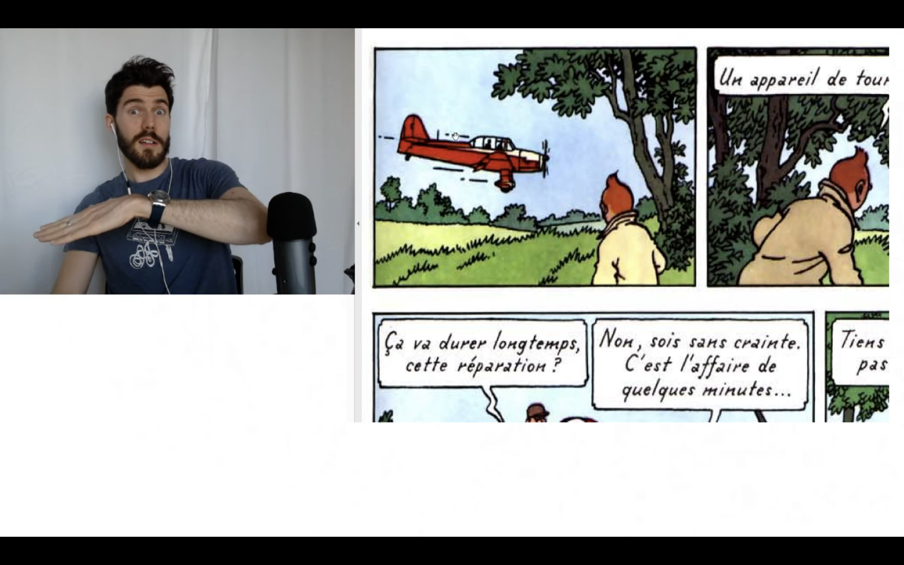
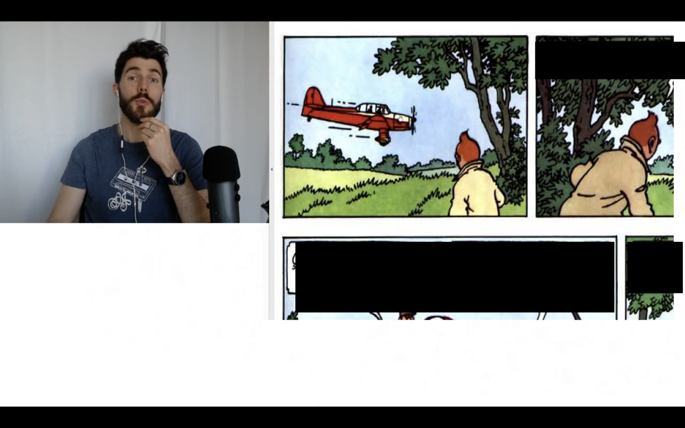

# Text Blocker

Automatically detect and censor text in videos using OCR. Perfect for **comprehensible input** — block subtitles, captions, or on-screen text to immerse yourself in your target language without the temptation to read.

## Example

| Before | After |
|--------|-------|
|  |  |

*French comic dialogue automatically detected and blocked*

## Installation

```bash
pip install opencv-python easyocr Pillow imagehash numpy yt-dlp
```

Requires [ffmpeg](https://ffmpeg.org/) and ffprobe in your PATH. Playlist support also needs `yt-dlp`.

## Usage

```bash
python text_blocker.py input.mp4 -o output.mp4
```

### Options

| Option | Default | Description |
|--------|---------|-------------|
| `-o, --output` | required | Output video file |
| `-l, --languages` | `en` | Languages to detect (e.g., `-l en fr de`). Use `all` for multi-language |
| `--ocr-height` | `360` | Height for OCR processing (lower = faster) |
| `--sample-fps` | `1.0` | How many frames per second to analyze |
| `--padding` | `14` | Pixels to expand around detected text |
| `--merge-pad` | `6` | Merge nearby boxes within this distance |
| `-q, --quality` | `high` | Output quality: `lossless`, `high`, `balanced`, `fast` |
| `-v, --verbose` | off | Show progress |

### Examples

Block English text with default settings:
```bash
python text_blocker.py video.mp4 -o clean.mp4
```

Block French and English text with verbose output:
```bash
python text_blocker.py video.mp4 -o clean.mp4 -l en fr -v
```

Fast processing for previews:
```bash
python text_blocker.py video.mp4 -o preview.mp4 --sample-fps 0.5 -q fast
```

Process a YouTube playlist (downloads to `temp_downloads`, outputs to `output`):
```bash
python text_blocker.py --playlist "https://www.youtube.com/playlist?list=..." -o output -l en -v
```
Playlist and YouTube outputs are named using the video title plus ID for readability.

Process a single YouTube video:
```bash
python text_blocker.py "https://www.youtube.com/watch?v=VIDEO_ID" -o blocked.mp4 -l en -v
```

Process a folder of videos:
```bash
python text_blocker.py --folder /path/to/videos -o output -l en -v
```

## How It Works

1. Extracts frames at a configurable sample rate
2. Runs OCR detection (not recognition) to find text regions
3. Skips similar frames to save processing time
4. Generates time-ranged `drawbox` filters for ffmpeg
5. Re-encodes the video with black boxes over detected text

## License

MIT
